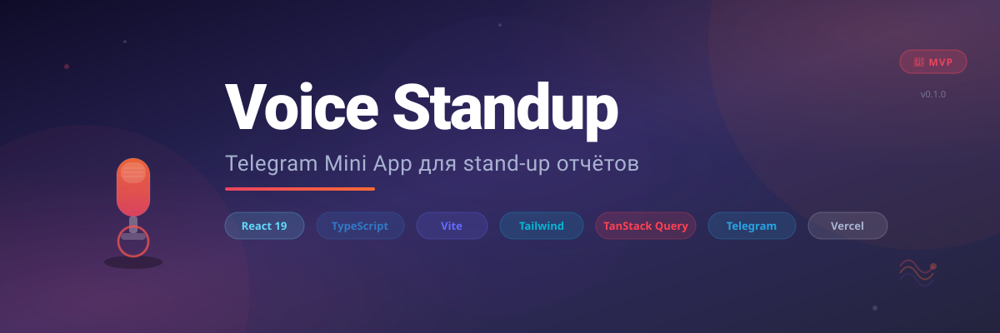
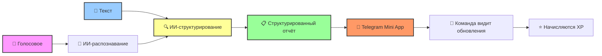

  

<h1 align="center">🎙️ Voice Standup</h1>

  <strong>Telegram Mini App для stand‑up отчётов с голосом и ИИ</strong>

  
  
  

  
  
  
  
  
  

---

## 💎 Что это?

**Voice Standup** — это интеллектуальная система, которая превращает хаотичные голосовые сообщения и текстовые заметки в **структурированные stand‑up отчёты**. Больше никаких «что‑то поделал» — только чёткие списки **Сделано**, **В планах** и **Препятствия**.

> 🚧 Проект в активной разработке. MVP готов, бэкенд и голосовое распознавание подключаются.

---

## 📱 Интерфейс

  <input type="radio" name="phone" class="phone-input" checked>
  <input type="radio" name="phone" class="phone-input">
  <input type="radio" name="phone" class="phone-input">
  <input type="radio" name="phone" class="phone-input">
  <input type="radio" name="phone" class="phone-input">
  <input type="radio" name="phone" class="phone-input">
  <input type="radio" name="phone" class="phone-input">
  <input type="radio" name="phone" class="phone-input">
  <input type="radio" name="phone" class="phone-input">

  
1 / 9

  

    

      
      
📋 Мои команды

    

    

      
      
👥 Участники

    

    

      
      
👤 Состав команды

    

    

      
      
📊 Лента отчётов

    

    

      
      
👤 Профиль

    

    

      
      
📄 Детали отчёта

    

    

      
      
📨 Приглашение

    

    

      
      
✏️ Создание команды

    

    

      
      
🌙 Светлая тема

    

  

  

    <label class="phone-dot"></label>
    <label class="phone-dot"></label>
    <label class="phone-dot"></label>
    <label class="phone-dot"></label>
    <label class="phone-dot"></label>
    <label class="phone-dot"></label>
    <label class="phone-dot"></label>
    <label class="phone-dot"></label>
    <label class="phone-dot"></label>
  

 
<em>💡 Кликай на точки, чтобы переключать экраны</em>

---

## ⚡ Почему Voice Standup?

<table align="center">
  <tr>
    <td align="center" width="33%">
      <h3>🚀 Быстро</h3>
      Отправляй голосовое или текст — мы превратим это в готовый отчёт за секунды.
    </td>
    <td align="center" width="33%">
      <h3>🎯 Структурированно</h3>
      Автоматическое разделение на «Сделано», «В планах», «Препятствия».
    </td>
    <td align="center" width="33%">
      <h3>🤖 С ИИ‑помощником</h3>
      Распознавание речи и интеллектуальное структурирование текста.
    </td>
  </tr>
  <tr>
    <td align="center">
      <h3>👥 Команды</h3>
      Создавай команды, добавляй участников по ссылке-приглашению.
    </td>
    <td align="center">
      <h3>📊 Статистика</h3>
      Отслеживай активность: отчёты, дни активности, уровень и XP.
    </td>
    <td align="center">
      <h3>🔒 Безопасно</h3>
      Авторизация через Telegram — никаких паролей.
    </td>
  </tr>
</table>

---

## 🔄 Как это работает

